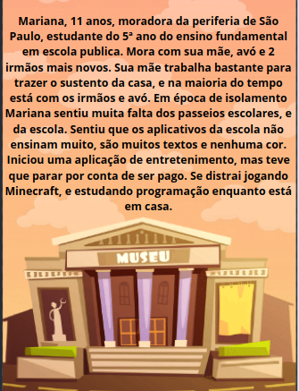
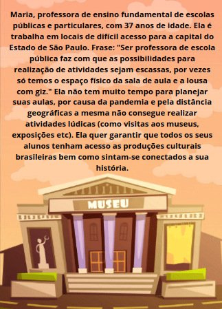
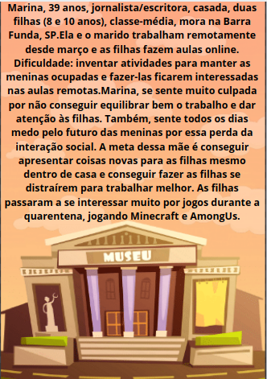
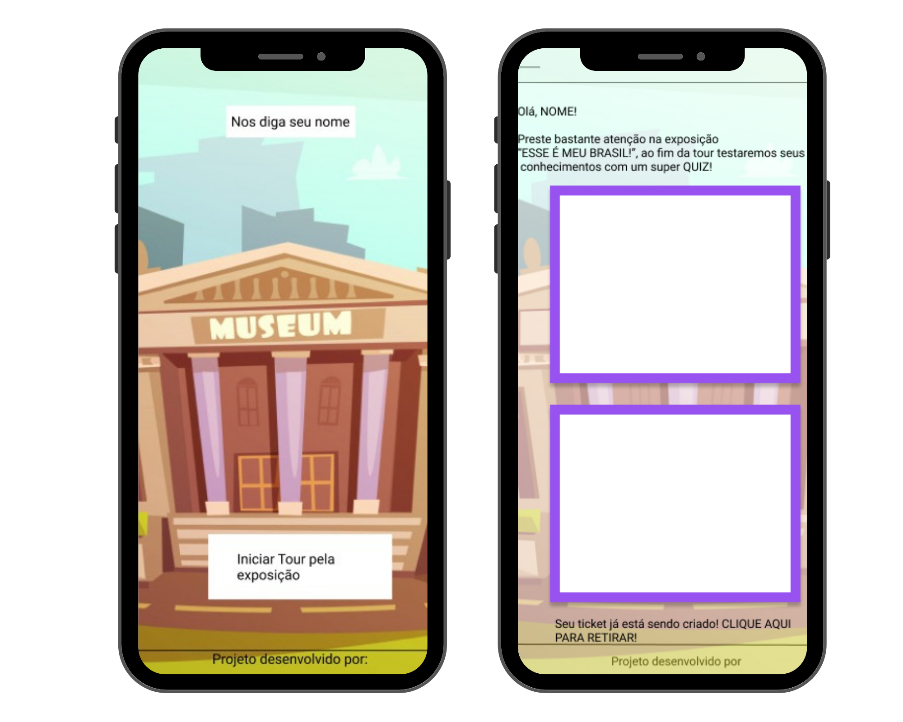

Projeto desenvolvido durante o Midterm Hackton do Bootcamp da Laboratória. Nesse projeto, o mais importante era aprender sobre o consumo de APIs.

[**Conheça o Museu Virtual :ticket:**](https://anaclara-gf.github.io/SAP005-midterm-hackaton/src/) 
> Status do Projeto: Concluído :heavy_check_mark:

---

## Índice

- [1. Apresentação do Projeto](#1-apresentação-do-projeto)
  - [1.1 Como utilizar a aplicação](#1.1-como-utilizar-a-aplicação)
- [2. Planejamento](#2-planejamento)
- [3. Desenvolvimento](#4-desenvolvimento)
  - [3.1 Problema a ser resolvido](#3.1-problema-a-ser-resolvido) 
  - [3.2 Histórias de Usuário](#3.2-histórias-de-usuário)
  - [3.3 Mínimo Produto Viável](#3.3-mínimo-produto-viável)
  - [3.4 Protótipos](#3.4-protótipos)
- [4. Habilidades Desenvolvidas](#4-habilidades-desenvolvidas)  
- [5. Desenvolvedoras](#5-desenvolvedoras)

---

## 1. Apresentação do Projeto :clipboard:

O Museu Virtual foi uma aplicação criada pensando em trazer para as crianças um pouco da vivência dos museus de forma lúdica e interativa sem a necessidade de sair de casa.
Também é uma ótima oportunidade para professores apresentarem a seus alunos, de forma didática, um pouco de nossa herança cultural. De igual modo, é uma ferramenta para os pais apresentarem a seus filhos um pouco das obras de arte, sem a necessidade de visitar presencialmente museus, nestes tempos de pandemia.

### 1.1 Como utilizar a aplicação :pencil2:

A aplicação foi pensada para que a própria criança a utilize de forma intuitiva e amigável. Acessando o site do [Museu Virtual](https://anaclara-gf.github.io/SAP005-midterm-hackaton/src/) a criança se deparará com a página inicial e um campo para preencher com seu nome. Feito isso, poderá clicar no botão indicado para iniciar o seu tour virtual.

**:art: GALERIA**
>Na página da galeria do Museu Virtual, a criança será apresentada ao acervo de obras que foram selecionadas visando a apresentar um panorama da cultura nacional.
>Após visitar o acervo digital, a criança será recompensada com um ticket de prata, bastando clicar no botão indicado para obtê-lo. Trata-se de um prêmio por ter tido contato com as obras e se familiarizado com elas. Caso queira, a criança poderá clicar em um botão que a direcionará a um quiz.

**:game_die: QUIZ** 
>Na página do quiz a criança será apresentada a uma série de perguntas de múltipla escolha a respeito dos quadros vistos na galeria. Respondendo e acertando todas as perguntas, será premiada com um ticket de ouro, disponível ao clicar no botão que será indicado. 

 

---

## 2. Planejamento :memo:

A equipe utilizou a ferramenta _Trello_ para fazer todo o planejamento e organização do projeto. Abaixo a imagem do quadro que a equipe criou para tal fim. 
Se quiser saber um pouco mais sobre o planejamento do projeto, basta acessar nosso quadro através desse [link](https://trello.com/b/Naq3rEqF/api-museu).

## 3. Desenvolvimento :bulb:

### 3.1 Problema a ser resolvido :warning:
No atual cenário de isolamento social por conta da pandemia do Covid-19, o acesso aos museus ficou prejudicado (afinal, parte do público não os visitaria, por medo de se contaminar). O objetivo da aplicação, assim, seria dar acesso virtual à obras de arte, permitindo que um público de crianças (sobretudo entre 8 e 12 anos) tenha contato com nossa herança cultural.
Outro problema a ser resolvido é o da falta de uma aplicação lúdica e interativa que permita aos professores executarem propostas didáticas de ensino sobre artes e culturas (algo a completar, ou, no caso do período de pandemia, substituir visitas monitoradas a museus).
Por fim, outro problema é a necessidade que os pais têm de algo educativo que possa ensinar e entreter seus filhos que estariam entediados e trancados dentro de casa nesse período de pandemia.

### 3.2 Histórias de usuário :bookmark_tabs:

Iniciou-se  a investigação de quem seriam as proto personas através de um formulário com perguntas genéricas sobre a temática escolhida (os museus e a visitação às exposições), para inicialmente entender sobre as preferências dos frequentadores e dos não frequentadores de museus. Refinou-se essa pesquisa e conseguiu-se identificar algumas dores e necessidades desses usuários, sendo assim definido o público alvo. Na sequência dessa investigação foram realizadas entrevistas com diversas pessoas, entre elas, mães/pais, professores e crianças de 8 a 12 anos, para entender o que essas pessoas achavam e queriam das visitas aos museus e possíveis aplicações relacionadas à isso. Refinadas as entrevistas ficaram estabelecidas as três personas apresentadas a seguir.

###  Protopersonas :woman:

  
### 3.3 Mínimo Produto Viável :hourglass_flowing_sand:

Após pesquisas com os usuários e definição das personas, estabeleceu-se o problema a ser resolvido e, então, foi possível conceber o Mínimo Produto Viável (que se apresenta como uma solução inicial a tais problemas).
Percebeu-se que o mais eficaz seria desenvolver uma ferramenta lúdica para conseguir captar a atenção dos usuários aos quais se destina (isto é, crianças, sobretudo dos 8 aos 12 anos).
Partindo disso e da temática dos museus, decidiu-se por fazer uma aplicação que apresentasse obras de arte (como nos museus) e trouxesse a possibilidade de brincar com o conhecimento adquirido a partir da fruição das obras.
Ou seja, a aplicação deveria trazer, como Mínimo Produto Viável, obras artísticas e questionários de múltipla escolha sobre tais obras, além de recompensas para quem navegasse pelo acervo e acertasse as respostas. É este Mínimo Produto Viável que é apresentado aqui e foi desenvolvido de acordo com a idealização.

### 3.4 Protótipos :iphone:

O projeto foi desenvolvido utilizando o método _mobile first_. A seguir as telas do protótipo de média fidelidade para a página inicial da aplicação e a página da galeria. 

## 4. Habilidades Desenvolvidas :dart:

:pushpin: HTML semântico 
:pushpin: CSS  
:pushpin: Vanilla Javascript  
:pushpin: Colaboração pelo Github 
:pushpin: Design Sprint 
:pushpin: Experiência do Usuário (UX) 
:pushpin: MVP (Mínimo Produto Viável) 
:pushpin: Consumo de API

#### Soft Skills

:pushpin: Colaboração 
:pushpin: Trabalho em squad 
:pushpin: Empatia entre os membros da equipe 
:pushpin: Diálogo entre os membros da equipe 
:pushpin: Manejo do estresse 
:pushpin: Planejamento 
:pushpin: Saber pedir ajuda às colegas do squad

## 5. Desenvolvedoras :computer:

Para conhecer um pouco mais do trabalho de cada uma das desenvolvedoras desse projeto, clique nos seus nomes a seguir:

#### :octocat: [**Ana Clara Farah**](https://github.com/anaclara-gf) 

#### :octocat: [**Camila Kikuchi**](https://github.com/CamilaKikuchi) 

#### :octocat: [**Karine Frontelli**](https://github.com/KarineFrontelli) 

#### :octocat: [**Mairã Soares**](https://github.com/MairaSoares) 

#### :octocat: [**Priscila Silveira**](https://github.com/PriscilaSSilveira) 

#### :octocat: [**Rebeca Canesin**](https://github.com/rebecaCanesin)
---